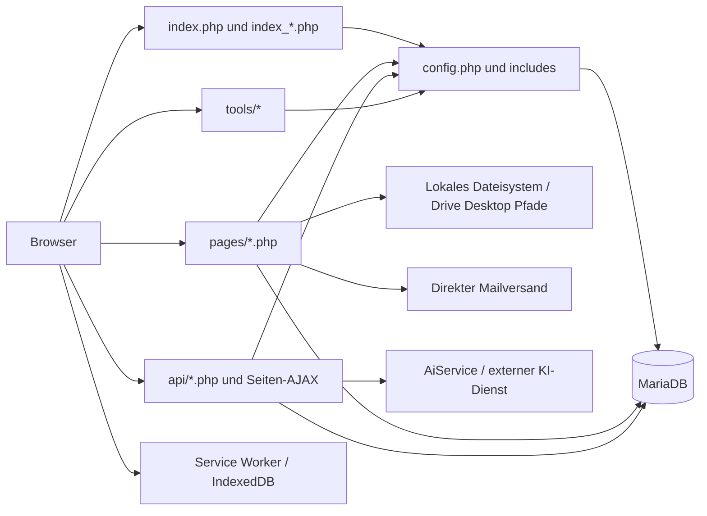

# Systeminventur und Abgleich der Voranalyse

Stand: 10.09.2026. Ergebnis der ausdrücklich beauftragten Analysephase; keine Implementierungsfreigabe.

## Prüfumfang und Aussagegrenzen

Beide Auftragsdokumente vollständig gelesen. Keine AGENTS.md im Projekt einschließlich Unterordnern oder in den geprüften Vorfahren C:/, C:/xampp/, C:/xampp/htdocs/ gefunden. Lokaler Code und lokale MariaDB wurden untersucht. Der Projektordner ist kein Git-Repository. Ein identischer Live-Stand ist **nicht nachgewiesen**: kein Deployment-Manifest, kein Live-Codehash und kein produktiver Schemaexport liegen vor. Der Linux-Pfad steht als Kommentar in config.php; die tatsächliche Serverkonfiguration wurde nicht ausgelesen.

Alle Quelltextdateien des Inventars wurden automatisiert eingelesen, nach Referenzen, SQL, Guards und Seiteneffekten untersucht. Kritische Einstiegspunkte und die beauftragten Kernmodule wurden zusätzlich im Kontext manuell geprüft. Das ist keine Behauptung, jede mögliche Laufzeitverzweigung oder jede dynamisch zusammengesetzte SQL-Abfrage getestet zu haben. Das vollständige Routenregister kennzeichnet Suchmarker ausdrücklich als Hinweise, nicht als bewiesene Zugriffskontrolle.

Keine Anwendungsseite wurde ausgeführt: selbst GET-Aufrufe können DDL, Datenänderungen, Dateibewegungen oder Versand auslösen. Datenbankabfragen liefen über eine separate mysqli-Verbindung mit `START TRANSACTION READ ONLY`, ohne Ausführung von config.php oder Anwendungs-Bootstrap. Erhoben wurden Schema, Indizes, Fremdschlüssel und aggregierte Bestandszahlen; keine Datensatzinhalte, Zugangsdaten oder Tokens sind Bestandteil der Berichte. Ausschließlich neue Analyseartefakte wurden angelegt.

## Bestand

| Messung | Voranalyse | Aktueller lokaler Befund |
|---|---:|---:|
| PHP-Dateien ohne vendor | ca. 485 | 842 einschließlich Kopien und Sonderverzeichnissen |
| SQL-Dateien ohne vendor | ca. 248 | 254 |
| Dateien pages / api / includes / uploads | 430 / 74 / 47 / 311 | bestätigt |
| Benutzer / Projekte / Pendenzen | 18 / 12 / 46 | 11 / 12 / 111, ungefilterte Tabellenzählung |
| Objekte / Wohnungen / Räume | nicht beziffert | 12 / 31 / 201 |
| Datenbank | MySQL/MariaDB | lokale MariaDB 10.4.32, 138 Tabellen |
| Projekt 4: Drive-Fehler | 27 | lokal 17 Einheiten; keine Fehlerzählung durch Sync reproduziert |

Die Zahlen können unterschiedliche Zeitpunkte, Datenbanken oder Dashboardfilter beschreiben. Sie beweisen keine verlorenen Daten. Rohbelege: `schema-local-readonly.json`, `data-quality-readonly.json`.

Das detaillierte Quelltextinventar enthält 1.139 Dateien einschließlich 835 PHP-Dateien; Uploads, Storage, Logs, Vendor, Vorlagenmedien und Bildverzeichnisse sind dort bewusst ausgenommen. 167 PHP-Dateien enthalten DDL-Marker einschließlich historischer Kopien. 207 Gruppen identischer Quelltextinhalte wurden erkannt. Vollständige Listen: `source-inventory.json`, `duplicate-groups.json`, `route-register.md`, `table-code-map.json`.

## Tatsächliche Architektur

`index.php` lädt `index_public.php`. Rollen-Dashboards sind eigenständige PHP-Dateien. Es gibt keinen durchgängigen Frontcontroller; die Rewrite-Regel in `.htaccess` ist auskommentiert. `public/index.php` ist kein nachweislich produktives Webroot und verwendet Funktionen, die sein Bootstrap nicht vollständig bereitstellt.

## Module und voraussichtlich aktive Dateien

„Aktiv“ bedeutet hier im aktuellen Hauptbaum vorhanden und durch Navigation, Includes oder Fetch-Aufrufe referenziert; tatsächliche Live-Nutzung benötigt Zugriffslogs/Deploymentabgleich.

| Modul | Dateien / Einstiegspunkte | Daten |
|---|---|---|
| Login, Rollen, Benutzer | login.php, logout.php, includes/auth.php, authz.php, pages/benutzer.php, profil.php, api/benutzer_*.php | benutzer, benutzer_profile, user_events, Einladungen |
| Projekte, Struktur | pages/projekte.php, projekt_detail.php, projekt_dashboard.php, projekt_baum.php, objekt_*.php, wohnung_*.php | projekte, objekte, wohnungen, raeume |
| Pendenzen | pages/pendenzen.php, pendenz_show.php, pendenz_neu.php, api/pendenzen_*.php, app/modules/pendenzen/Service.php | pendenzen, listen, listen_spalten, Medien, ACL |
| Terminplanung / Pläne | pages/terminprogramm.php, projekt_plaene.php, plan_zonen_edit.php, api/gantt_task_create.php, pendenzen_inline_save.php | pendenzen.vorgaenger_id, projekt_plaene, plan_zonen |
| Protokolle / PDF | pages/abnahme*.php, wohnungsabnahme_protokoll.php, wohnungsabnahme_save.php, pdf_designer.php, pendenz_pdf.php, api/*templates.php | abnahmen, abnahme_protokolle, protokoll_*, pdf_templates |
| Ablage | includes/fs.php, user_folder_automation.php, pages/files.php, file.php, storage_manager.php, quick_folder_editor.php, project_storage.php | fs_nodes, fs_folder_meta, ordner_links und mehrere Parallelmodelle |
| Mietwesen | pages/mieterspiegel.php, mieter_zuweisen.php, vertrag_gen.php, vertrag_save.php, tools/mietkontrolle/index.php, includes/rent.php | wohnung_mieter und mehrere Mietmodelle |
| Finanzen | tools/konto_verwaltung/index.php, import.php, pages/finanzen.php | liegenschafts_konto, kv_*, finanzen_konto |
| Nachrichten | pages/benachrichtigungen.php, includes/nav_notifications.php, api/notifications_*.php, includes/pendenz_workflow.php | drei Benachrichtigungsmodelle |
| Chat / KI | pages/chat.php, ai_assistant.php, api/chat*, ai_query.php, ai_chat_messages.php, app/modules/ai/AiService.php | chat_*, ai_* |
| Offline | sw.js, assets/js/offline_sync.js | Browsercache, IndexedDB; keine Drive-Jobqueue |

## Abhängigkeiten und Betrieb

Composer hat eine direkte Abhängigkeit: dompdf/dompdf `^3.1`, Lockversion 3.1.0. Vier transitive Pakete: php-font-lib 1.0.1, php-svg-lib 1.0.0, masterminds/html5 2.10.0, sabberworm/php-css-parser 8.9.0. „Einzige Bibliothek“ stimmt somit nur für direkte Abhängigkeiten. Kein Google-API-Client und kein Testframework im Composer-Manifest. Externe Browserbibliotheken und gebündeltes html2pdf müssen getrennt inventarisiert und später gegen aktuelle Herstellerhinweise geprüft werden; keine pauschale Aussage „Abhängigkeiten sicher“.

PHP verwendet mysqli, einzelne APIs erwarten dagegen PDO. PHP-8-Funktionen wie str_contains/str_ends_with werden verwendet; eine aktuelle Laufzeitfreigabe für den Live-Server fehlt. Konfiguration enthält feste lokale/Online-Verbindungsparameter und Host-basierte Umgebungserkennung. CLI wird stets als lokal eingestuft: ein produktiver Cronjob kann deshalb die falsche DB-Konfiguration verwenden. `app/` enthält lediglich Autoloader, KI-Service und Pendenzservices; die Modulstruktur in docs/architecture.md ist ein Zielbild.

## Kopien, Wartung und Archivierungskandidaten

Vollständige Kategorien und Pfade im Inventar. Beispiele: `pages/pages per 07.05.2026/`, `pages/aus homepage/`, `*Kopie*.php`, `includes/header.bak.php`, `config - Kopie.php`, `Absicherung vor löschen/`, Rootdateien `scratch_*`, `debug_*`, `fix_*`, `migration_*`, `run_*`, `test_*`. Diese Dateien nicht anhand des Namens löschen: zuerst statische Referenzen, dynamische Menüs, Cron, Serverkonfiguration und Wiederherstellungszweck prüfen. Danach in einer späteren Phase außerhalb des Webroots archivieren, mit Hashmanifest und getesteter Rückholung.

`.htaccess` schützt das Root nicht systematisch. Korrektur zur Voranalyse: `logs/.htaccess` enthält bereits `Require all denied`; `api/.htaccess` sperrt einige sensible Erweiterungen. `uploads/.htaccess` enthält einen Versuch, PHP-Ausführung abzuschalten. Dessen Wirksamkeit hängt vom PHP-Handler und AllowOverride ab und verhindert nicht automatisch die Auslieferung privater Dokumente.

## Verifikation bekannter Fehler

| Aussage | Ergebnis / Beleg |
|---|---|
| project_storage: require_login undefiniert | bestätigt im Includegraph: pages/project_storage.php:10 ruft die Funktion ohne auth.php auf; config.php lädt nur functions.php |
| ordner_vorlagen_nodes.name fehlt | bestätigt: Seite Zeilen 27/80 erwartet name; lokale Tabelle hat id, vorlage_id, rel_path, is_dir, sort |
| Protokollmanager/Audit leer | präzisiert: pages/protokoll_manager.php und pages/audit.php fehlen; nav_superadmin.php:868/908 verlinkt sie. Manager existiert nur in historischer Kopie |
| Fehleranzeige produktiv aktiv | im lokalen Produktionszweig von config.php:40/41 bestätigt; Live-Konfiguration nicht geprüft |
| Windows-Drivepfade | bestätigt; alle 12 lokalen Projektroots sind Windows-Pfade und lokal nicht erreichbar |
| Prune löscht Wohnungen | bestätigt: includes/fs.php:482 und pages/mieterspiegel.php:198 |
| Benachrichtigungen doppelt | untertrieben: drei Tabellen einschließlich benachrichtigungen mit FK auf users |
| Mietkontrolle vorhanden | Code vorhanden, aber zwei erwartete Tabellen fehlen lokal |
| Scheduler fehlt | kein allgemeiner Fristen-Scheduler gefunden; maintenance/expire_invites.php ist vorhandener spezieller CLI-Erinnerungslauf. Installation in Cron unbekannt |

Syntaxprüfung: 835 PHP-Dateien via `php -n -l`, ein Fehler in `migration_online_columns.php:158`. Ergebnisdatei: `php-lint-results.json`. Syntaxprüfung führt die Anwendung nicht aus und ersetzt keine Funktionsprüfung.
