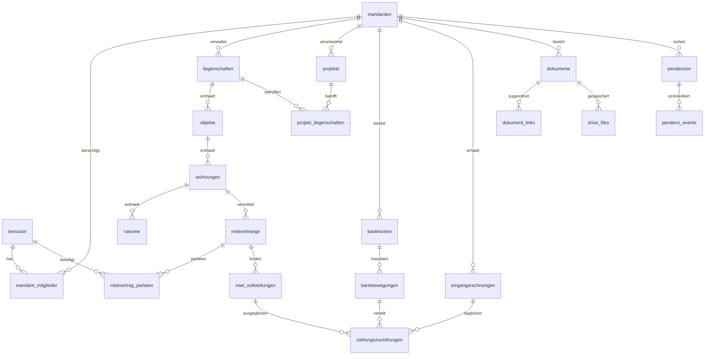

# Ist-Datenmodell und Zielentwurf

Stand 10.09.2026. Maßgeblich für lokale Aussagen ist `schema-local-readonly.json`: alle 138 Tabellen mit Spalten, Nullbarkeit, Indizes und Fremdschlüsseln sowie aggregierten Zeilenzahlen. Keine Produktivschemafreigabe.

## Istmodell

```mermaid
erDiagram
  projekte ||--o{ objekte : projekt_id
  objekte ||--o{ wohnungen : objekt_id
  wohnungen ||--o{ raeume : wohnung_id
  wohnungen ||--o{ wohnung_mieter : wohnung_id
  benutzer ||--o{ wohnung_mieter : benutzer_id
  benutzer ||--o{ projekt_mitglieder : benutzer_id
  projekte ||--o{ projekt_mitglieder : projekt_id
  benutzer ||--o{ benutzer_projekte : alternative_Zuordnung
  projekte ||--o{ benutzer_projekte : alternative_Zuordnung
  projekte o|--o{ pendenzen : fachlicher_Bezug
  wohnungen o|--o{ pendenzen : fachlicher_Bezug
  pendenzen ||--o{ pend enz_dateien : placeholder
```

Die folgende kompakte Ergänzung ersetzt keine FK-Liste: Pendenzmedien liegen in `pendenz_dateien`, `pendenz_anhaenge`, `anhaenge`; Verträge in `mietvertraege`, `mietverhaeltnisse`, `wohnung_mieter`, `kv_mietvertraege`; Ablage in `fs_nodes`, `ordner_links`, `fs_folder_meta`, `ordner`, `folders`, `files`, `documents`. Beziehungen „fachlicher Bezug“ sind nicht als durchgängig vorhandene DB-Constraints zu verstehen. Vollständige tatsächlich deklarierte FKs stehen im Schemaartefakt.

## Zentrale Widersprüche

| Bereich | Lokales Schema / Bestand | Erwartung im Code bzw. Basisschema | Vorgehen nach Freigabe |
|---|---|---|---|
| Rollen | benutzer.rolle = superadmin/admin/benutzer/gast | database/schema.sql: kunde/mitarbeiter/projektleiter/admin/superadmin; mehrere Seiten verlangen projektleiter | globale Rolle von fachlicher Mitgliedschaft trennen; Altrollen explizit zuordnen |
| Mitgliedschaften | benutzer_projekte 7 Zeilen, projekt_mitglieder 0, projekt_memberships 0 | auth.php verwendet projekt_mitglieder; weitere UI nutzt alternative Zuordnungen | Rechtevergleich pro Benutzer/Projekt, kein blindes Erteilen von owner |
| Mandant | pendenzen.mandant_id vorhanden und in 111 Zeilen belegt; keine mandanten-Tabelle | Voranalyse beschreibt Mandanten als vollständig fehlend | Spaltenbedeutung aus bisherigen Werten/Schreibern klären, nicht mit Projekt-ID gleichsetzen |
| Liegenschaften | liegenschaften existiert mit id/name und 2 Zeilen | Code benutzt auch projekte/objekte als Liegenschaft | bestehende Entität erweitern, Mapping prüfen |
| Portfolio | Projekte 9/10/11 tragen lokal Präfixe 101/102/103 | keine eigenen Eigentümerentitäten | Präfixe sind keine Primärschlüssel! Mapping als geprüfte Datensätze |
| Ordnerknoten | ordner_vorlagen_nodes: rel_path, is_dir, sort; name fehlt | pages/ordner_vorlagen.php: name schreiben/lesen/sortieren | Anzeige aus Pfad ableiten oder begründete Zusatzspalte; alte Struktur erhalten |
| Speicherroot | projekte.root_path vorhanden, storage_root fehlt | storage_manager.php:39 selektiert beide gemeinsam, fängt Fehler ab und nutzt lokalen Fallback | Query korrigieren; kein stiller Wechsel des Ablageortes |
| Wohnungen | name vorhanden; bezeichnung und bild fehlen | Kontoindex erwartet bezeichnung; pendenz_review.php erwartet bild | kanonische Felder definieren, gezielter Adapter |
| Mietkontrolle | wohnung_mietverhaeltnis und wohnung_miet_override fehlen | tools/mietkontrolle/index.php:51/69 | keine leeren Tabellen vortäuschen; vorhandene Vertragsquellen zuerst zuordnen |
| Pendenzstatus | ENUM offen/in Bearbeitung/erledigt/archiviert; 3 leere Statuswerte | UI/Public schreibt Unt. Erledigt.; wf_change_status schreibt fehlendes status_workflow | Statusmaschine plus verlustfreie Altwertzuordnung |
| Pendenz speichern | prioritaet, zugewiesen_an fehlen | api/pendenzen_save.php erwartet beide | an aktuelle Wichtigkeit/Zuständigkeit anpassen |
| Pendenz löschen | deleted_by fehlt | api/pendenzen_delete.php erwartet es, zusätzlich falscher DB-Bootstrap/PDO | zuerst Rechte, dann ein DB-Vertrag; Audit statt stiller Fehler |
| Benachrichtigungen | notifications, user_notifications, benachrichtigungen existieren | Writer und Reader greifen auf unterschiedliche Tabellen zu | Empfänger/Lesestatus/Quelle erhalten; Zielmodell vereinheitlichen |
| Benachrichtigungen FK | benachrichtigungen.user_id → users (0 Zeilen) | echte Benutzer in benutzer | vor FK-Wechsel explizites Benutzermapping |
| Passwortreset | user_tokens und benutzer.must_change_password fehlen | pages/password_reset*.php benötigt beides | sichere Tokenmigration und Hashquelle vereinheitlichen |
| Audit | actor_id/entity/entity_id/action/changes/ip | Basisschema: user_id/action/meta | aktuelle Historie erhalten, neue Ereignisse separat erweiterbar machen |
| Basisschema FKs | pendenzen.erstellt_von und custom_tables.created_by NOT NULL | gleichzeitig ON DELETE SET NULL | Basisschema ist nicht als zuverlässiger Neuaufbau geeignet |
| ID-Typen | projekte.id INT signed; fs_nodes.project_id INT unsigned | mehrere SQL-Dateien wechseln Signedness | alle referenzierenden Spalten zusammen planen, vorher Wertebereiche prüfen |

`kv_mandate` ist keine Mandantentabelle: type/value beschreiben QR/ESR/AUFTRAG/IBAN-Zuordnungen. `kv_buchungen` hat bereits einen Dublettenindex und `kv_import_batches` einen Dateihash; diese leeren Ansätze sind wiederverwendbare Entwürfe, keine belegte Integration des aktiven CSV-Imports.

## Datenqualität

9 Pendenzen haben `projekt_id IS NULL`; **0** Pendenzen haben eine gesetzte, aber nicht vorhandene Projekt-ID. NULL-Projekt ist bei persönlichen Aufgaben möglicherweise zulässig und kein bewiesener Datenfehler. Objekte→Projekte und Wohnungen→Objekte zeigen im geprüften Aggregate keine fehlenden Eltern.

Alle 111 Pendenzen sind lokal public_enabled/external_can_view/external_can_upload=1. Alle 265 liegenschafts_konto-Zeilen haben projekt_id und wohnung_id NULL, liegenschaft_id jedoch gesetzt. Die Zahlen belegen Zuordnungslücken, nicht die korrekte fachliche Interpretation des belegten Feldes. Die lokale SQL-Mode-Konfiguration enthält kein STRICT_TRANS_TABLES; das ist relevant für ungültige ENUM-Werte. Ursache der drei leeren Statuswerte ist plausibel, aber nicht historisch bewiesen.

## Empfohlenes Zielmodell



Zielnamen sind Planungsnamen, keine existierenden Tabellenbehauptungen. `zahlungszuordnungen` muss genau eine Forderungsart adressieren; ein geprüftes CHECK bzw. separate FK-Tabellen verhindert gleichzeitige Miet-/Rechnungszuordnung. `dokument_links` benötigt erlaubte Entitätstypen und serverseitige Mandantenprüfung; alternativ typisierte Linktabellen für echte FKs. Private Pendenzen erhalten einen expliziten persönlichen Scope, sofern fachlich gewünscht; sie werden nicht automatisch einem Eigentümerportfolio zugeschlagen.

Mandantentrennung wird bei jeder Abfrage und Mutation erzwungen, einschließlich Dateien, Exporte, KI-Kontext und Hintergrundjobs. Globale admin-Rolle darf nicht automatisch alle drei Eigentümerbereiche öffnen. Bestehende IDs bleiben erhalten; neue Eigentümerbezüge zunächst nullable, Backfill mit Mapping, anschließend Constraints für die freigegebenen Pflichtbeziehungen.
